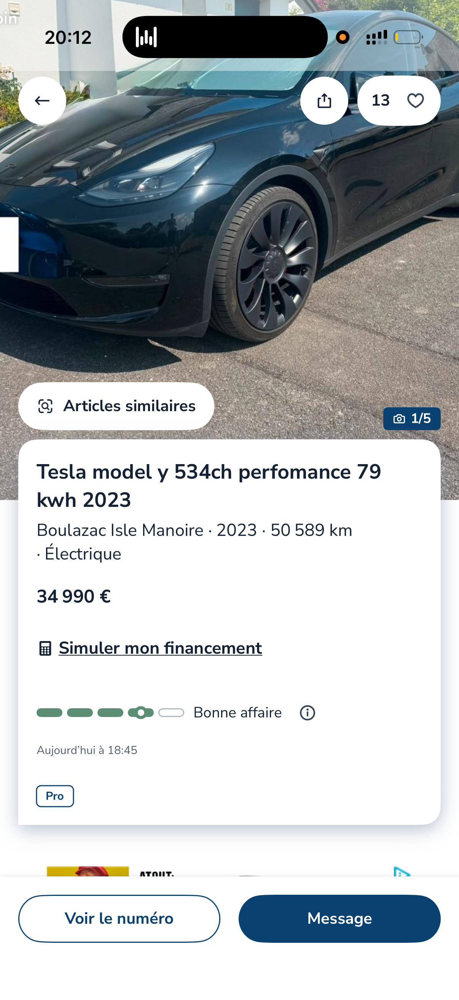

# Reading a real listing: Model Y vs. Model 3, and is this actually a good deal?

A real ad turned up on LeBonCoin near me in rural Dordogne while writing this — a good excuse to work through Model Y vs. Model 3 secondhand, and then actually price-check a live listing against the research so far.

## Model Y vs. Model 3, secondhand

The Y is the Model 3 platform stretched into a compact SUV — same drivetrain family, same Supercharger network, same software, but a hatchback boot and a much bigger load bay (2,100L seats-down vs. the 3's ~650L split trunk/frunk). For a lot of buyers that's the whole decision: SUV-shaped practicality without giving up the EV tech. It's also the best-selling EV in Europe by a wide margin — huge used supply and easy parts/service access, but the least distinctive choice on the road.

Weaknesses next to the 3: worse aerodynamics and more mass for the same battery means roughly 10-15% less real-world range per kWh. It commands a real price premium used — my banded data in [05-secondhand-price-bands.html](05-secondhand-price-bands.html) has the Y running about €4-6k above the equivalent-trim, equivalent-year Model 3 at every point. Bigger tires and brakes push maintenance and tire costs up slightly too.

Would I consider it secondhand? Yes — but I'd steer away from **Performance** unless the acceleration itself is the point. Performance adds real cost (purchase price, and French insurance — high-power EVs land in higher tariff bands) for a spec that doesn't touch daily TCO at all: similar-to-slightly-worse range than Long Range AWD (extra weight from the performance hardware, wider tires with more rolling resistance), and tires that wear faster and cost more to replace. Long Range AWD beats Performance on every axis except a 3-second 0-100 you'll use approximately never on French roads. Base Propulsion (RWD) is the cheapest entry but loses AWD traction, which matters more for an SUV than a sedan anywhere with real winters or unpaved roads.

## The listing

**2023 Model Y, "534ch Performance," 79kWh, 50,589km, €34,990, Pro seller, Dordogne.** First hurdle for anyone not already deep in EV specs: "534ch Performance, 79kWh" needs decoding before you can compare it to anything. The number is a French fiscal/marketing power figure, not literal horsepower — it decodes as the dual-motor **Performance** trim on the Long Range battery pack.

Against the sourced band for Performance 2022-2023 in [05-secondhand-price-bands.html](05-secondhand-price-bands.html) — **€38,000-47,000, 20-50k km** — this listing is priced meaningfully below the band, by roughly €3-12k depending on where a 50,589km car should sit within it. Two independent signals point the same direction: LeBonCoin's own "Bonne affaire" badge (trained on live comparable listings, not aggregator summaries), and the fact that it undercuts my own sourced numbers. That's a reasonable basis to think it's genuinely underpriced — held lightly, since my bands are themselves aggregator-summary estimates, not live-market ground truth.

**What could explain the gap, without it being a red flag:**

- Rural Dordogne has less Tesla demand than Paris or Lyon, so a lower local clearing price is plausible.
- 50,589km in roughly 2.5-3 years is ~17-20k km/year — above the French average of ~12-13k km/year, so it's a higher-mileage car than most in the comparison band. Pricing algorithms typically already discount for this.
- It's a **Pro** (professional) seller, not a private individual. In France, a professional seller is legally required to provide a *garantie légale de conformité* — a minimum 2-year statutory warranty on used cars — which a private sale wouldn't give you, and is a real point in this listing's favor.

**What I'd actually check before treating this as a deal:**

- **Battery State of Health (SOH)** — ask for a diagnostic read. Per the model/TCO survey, battery health is the single biggest driver of used-EV value, and a high-annual-mileage car is exactly where it matters most to verify rather than assume.
- **Histovec** — France's official vehicle history check, for accident/repair history.
- **DC fast-charging habit** — heavy Supercharger use accelerates degradation, and a high-mileage car is more likely to have relied on it.
- **The aftermarket wheels** visible in the photo — Performance trim ships with a different wheel style originally; dark aftermarket wheels aren't a problem by themselves, but worth asking whether the originals come with the car (affects resale later) and whether the swap correlates with harder driving.

## Why this is the interesting part

Getting to "this is probably a good deal, here's what to verify" took: decoding a marketing spec string, cross-referencing it against sourced trim-level price bands built earlier in this project, cross-checking a platform's own pricing signal, reasoning about regional demand and annual mileage, and knowing which French-specific consumer-protection detail (*garantie légale de conformité*) changes the risk calculus for a Pro seller vs. a private one. None of that is available from the ad itself, and no general-purpose AI assistant has it pre-loaded either — it took the research already built up over this whole project (the trim-level price bands in particular) to have anything concrete to check the listing against. That gap — between "here's an ad" and "here's whether it's actually good value" — is worth its own piece: [08-why-buying-a-used-car-is-hard.md](08-why-buying-a-used-car-is-hard.md).
