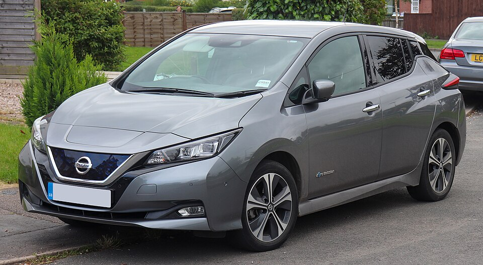
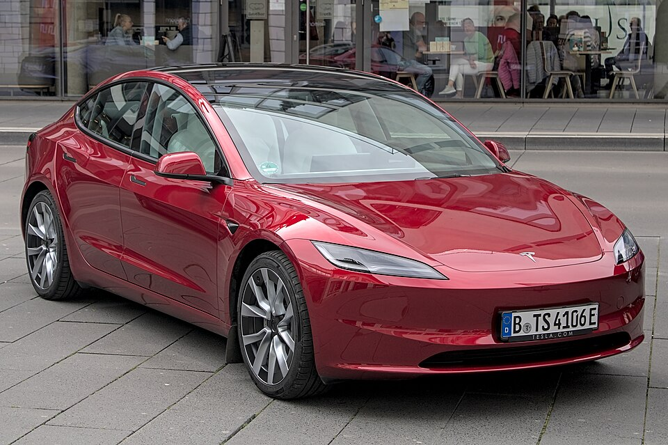

# Buying an Electric Car in France (2026)

*Part of [Buy a Car](../Buy%20a%20Car/) — CompareThe＿'s umbrella page for car-buying research.*

Facts and figures, sourced, instead of spammy SEO listicles or "it depends on your needs." I'm in the market for an EV in France — new or secondhand, open budget, no segment preference — and the real picture turned out to be two households' worth of car, not one: a cheap runabout for short local trips, and a nicer everyday family car. Of the 24 new-car trims surveyed, only 8 are actually efficient — everything else is beaten on both price *and* range by something already on this list. That frontier, and Euro NCAP safety data that reshuffled the "obvious" cheap picks more than price did, are the two things that decided this.

**Neither track is final yet** — a real weighted frontier (safety, charging speed, boot space, not just range) and a deeper pass on individual used listings are still open. See [what's still open](plan.md).

The verdict, at a glance

Vauxford, <a href="https://creativecommons.org/licenses/by-sa/4.0/">CC BY-SA 4.0</a>

Track A — budget, short-range

Nissan Leaf

Secondhand

€11,500–22,500
220-340km
★★★★★ 93%/86%

Best safety-to-price ratio here, real used market, proper 5-door. School run and 50-200km trips, where range barely matters.

Alt, no secondhand risk: <b>Peugeot e-208</b>, new €21,950, 433km, ★★★★★ — longest range and best resale of anything surveyed.

Alexander Migl, <a href="https://creativecommons.org/licenses/by-sa/4.0/">CC BY-SA 4.0</a>

Track B — everyday family car

Tesla Model 3

Secondhand, 2021-22 (Propulsion/SR+)

~€19,000–25,000
~430-500km
★★★★★

Not premium, but a step up. Beats several <i>new</i> mainstream cars on range and charging network at the same price.

Alt, no secondhand risk: <b>Peugeot e-208</b>, new €21,950, 433km, ★★★★★ — holds resale so well that new barely costs more than used.

Two names are on the data but not yet ranked: **VW ID.3** (new €34,990-48,100 / secondhand €17,790-39,990, 5★, one of the fastest-charging cars surveyed) is a real Track B contender not yet weighed head-to-head against the Model 3 and e-208. **VW ID.7** (€49,990-57,490, 615-709km WLTP, 5★) is genuinely premium — it tops the efficient frontier below on range — but it's priced above both tracks' recommendations, so it's a data point, not a pick.

**Ruled out despite attractive prices:** Dacia Spring (1★, and now excluded from the bonus écologique entirely) and Renault Zoe (0★ after Euro NCAP's 2021 retest) — see [why safety, not price, drove that call](#the-research).

## The whole market: the efficient frontier

Twenty-four new-car trims, city car to premium SUV, plotted on starting price against WLTP range. Only 8 are efficient — for every other car here, something cheaper in this survey also goes farther. Those 8 (marked ★, joined by the dashed line below) are: **Dacia Spring, Leapmotor T03, Peugeot e-208, Renault Mégane E-Tech, Hyundai Ioniq 5, Tesla Model 3, Peugeot E-3008**, and now **Volkswagen ID.7 Pro S** at the top end.

**A necessary caveat before reading too much into that ★ list: both axes on this chart are stand-ins, not the real thing.** The Dacia Spring anchors this frontier's cheap end on price and range alone — and it's a 1-star Euro NCAP car, ruled out for family use in Track A below. The used-market version of this same chart ([06](06-secondhand-price-vs-mileage.html)) makes it starker: once real secondhand listings are added, its frontier collapses to just two points, Dolphin Surf and Dacia Spring, with the Spring dominating on price at every mileage out to 160,000km. And "price" itself is the wrong x-axis on both charts — it's sticker price, not annualized cost of ownership, so a car with steep depreciation can look like a bargain here and not be one. Full notes on both problems: [12 — toward a real price/quality frontier](12-weighted-quality-score-notes.md).

  <iframe src="03-price-range-sketch.html" style="width:100%; height:660px; border:1px solid #dde1e4; border-radius:10px;" loading="lazy" title="Efficient frontier: price vs. WLTP range, new EVs sold in France"></iframe>

[Open the interactive chart →](03-price-range-sketch.html)

Worth being precise about what this frontier is and isn't: it's range-for-price only — no safety, charging speed, or running costs weighted in yet, and price is sticker price before incentives or depreciation. That's exactly why the e-208 and Model 3 recommendations above need the safety and TCO passes below to hold up, not just a spot on this line. Two entries here (Kia EV3, BYD Dolphin Surf) originally got plotted wrong in an earlier pass — a "from €X, up to Ykm" marketing-copy trap pairing one trim's price with a different trim's range. Full detail, running costs and depreciation trends: [model & TCO survey](02-model-tco-survey.md).

## Track A: budget, secondhand, short-range

Range barely matters at 50-200km trips, so price looked like it would settle this outright — until Euro NCAP safety ratings got checked, which reshuffled the list more than price did.

| Car | Condition | Price | Safety | Range (WLTP) | Verdict |
|---|---|---|---|---|---|
| **Nissan Leaf** | Secondhand | €11,500-22,500 | ★★★★★ 93%/86% | 220-340km | **Top pick** |
| Peugeot e-208 | New | €21,950 · secondhand €18,000-35,000 | ★★★★★ 93%/79% | 433km | Strongest new-car pick |
| BYD Dolphin Surf | New | €19,990-24,490 | ★★★★★ 82%/86% (newest 2025 protocol) | 220-322km | Competing, pending incentive eligibility |
| Fiat 500e | Secondhand | €13,990-18,350 | ★★★★ 76%/80% | ~190-320km | Solid #2, check rear-seat space |
| Dacia Spring | Secondhand from ~€6,500 | — | ★ 49%/56% | 220km | Ruled out on safety |
| Renault Zoe | Secondhand €9,500-19,500 | — | ☆ 0★ (2021 retest) | 395km | Ruled out on safety |

Full table with incentive-adjusted prices and running costs: [10-budget-ev-shortlist-comparison.md](10-budget-ev-shortlist-comparison.md). Same data as a cost chart (base price + 3 years' maintenance, stacked): [11-budget-shortlist-cost-bars.html](11-budget-shortlist-cost-bars.html).

*Citroën ë-C3 was earlier wrongly marked 0-star — that rating belongs to a different, India-spec car; the France-market ë-C3 is unrated, not confirmed unsafe. Renault Twingo E-Tech has no crash-test rating yet either.*

## Track B: a nicer everyday family car

Not premium, but a step up — this is where a secondhand Tesla Model 3 lands inside the price band of several *new* mainstream cars while very likely beating them on range and charging network.

| Car | Condition | Price | Safety | Range (WLTP) | Verdict |
|---|---|---|---|---|---|
| **Tesla Model 3** (Propulsion/SR+) | Secondhand, 2021-22, 50-90,000km | ~€19,000-25,000 | ★★★★★ | ~430-500km | **Top pick** |
| Peugeot e-208 | New | €21,950 | ★★★★★ | 433km | Fallback if secondhand risk isn't wanted |
| Volkswagen ID.3 | New €34,990-48,100 · secondhand €17,790-39,990 | — | ★★★★★ 87%/89% | 417-629km | Real contender, not yet ranked |
| Tesla Model Y | Secondhand | €4-6k above equivalent Model 3 | ★★★★★ | ~10-15% less than Model 3/kWh | Worth it for boot space, at a real premium |

Trim matters enormously with the Model 3/Y — Grande Autonomie or Performance is a meaningfully different, pricier car than base Propulsion, and Performance doesn't touch daily running cost at all. Full comparison plus a real LeBonCoin listing priced against this research: [07-reading-a-real-listing.md](07-reading-a-real-listing.md).

## What it actually costs, 5 years in

Sticker price isn't the number that matters — depreciation over those 5 years usually dwarfs everything else. Entry basis matches how this project actually recommends buying each car (new where that's the pick, near-new secondhand for the Leaf, which isn't sold new in France in 2026). Two findings worth flagging, not settling: a secondhand **Leaf comes out cheapest of all 8**, beating even the Dacia Spring, because entering already-depreciated avoids the steep early loss every new-bought car takes; and **Model Y currently beats Model 3** on 5-year cost — real but thin data (one listing each), so treat that one as provisional.

  <iframe src="13-five-year-cost-of-ownership.html" style="width:100%; height:760px; border:1px solid #dde1e4; border-radius:10px;" loading="lazy" title="5-year cost of ownership, 8 EVs sold in France"></iframe>

[Open the interactive chart →](13-five-year-cost-of-ownership.html)

## The research

Everything behind the verdict above, for anyone who wants the sourcing:

- **[01 — Tax incentives](01-tax-incentives.md):** bonus écologique can take €3,500-7,700 off a new EV under €47,000, or get a lease under €200/month under leasing social.
- **[02 — Model & TCO survey](02-model-tco-survey.md):** EVs depreciate 50-60% over 3 years (vs. 30-40% for petrol) — battery health drives resale more than anything else. Running costs average ~€4,300/yr vs ~€5,250/yr for petrol, except insurance, which now costs more for EVs since a 2025 tax-exemption change.
- **[04 — Secondhand market survey](04-secondhand-market-survey.md):** used-listing price bands and the Euro NCAP pass that reshuffled Track A twice — includes why a 0-1 star rating on a car sold today is a real, structural trade-off, not a scandal.
- **[05 — Secondhand price bands](05-secondhand-price-bands.html)** and **[06 — price vs. mileage](06-secondhand-price-vs-mileage.html):** why trim matters more than nameplate for Tesla specifically, and a first (aggregator-sourced, not live-listing) Pareto cut on used prices.
- **[08 — Why buying a used car is hard](08-why-buying-a-used-car-is-hard.md):** stub piece on the general problem, growing out of the listing case study above.
- **[09 — EV vs. ICE total cost](09-ev-vs-ice-total-cost.md):** is an EV actually better value than a cheap petrol car once purchase price and depreciation are counted, not just running costs? Yes, on both tracks, even before incentives, for anyone near French average annual mileage.
- **[12 — Appendix: notes toward a real price/quality frontier](12-weighted-quality-score-notes.md):** two open axes, not one — a weighted quality score (safety, charging speed, degradation risk, reliability) to replace range/mileage, *and* annualized cost of ownership to replace sticker price. Not solved yet, just mapped.
- **[13 — 5-year cost of ownership](13-five-year-cost-of-ownership.html):** the annualized-cost axis from 12, actually computed for 8 cars — see [above](#what-it-actually-costs-5-years-in).

## What's next

The weighted frontier (charging speed, safety, boot space, brand reliability — not just range; see the [design notes](12-weighted-quality-score-notes.md)), a deeper pass on individual used listings, VW ID.3/ID.7 properly weighed against the current picks, and a final purchase decision. Tracked in [plan.md](plan.md).
