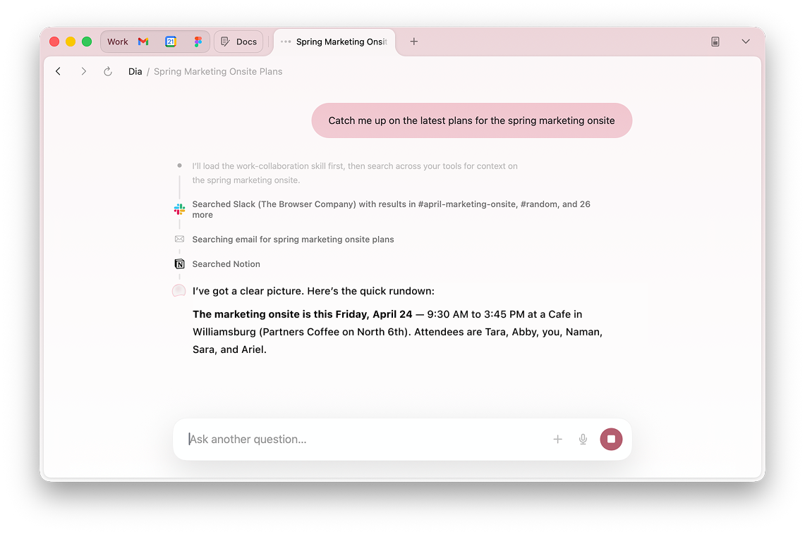

# ChatGPT Atlas Is Shutting Down. What Browser Should I Use Instead?

ChatGPT Atlas is shutting down. More precisely, OpenAI says Atlas is scheduled to stop working on **9 August 2026**—not the 20th, as I first thought. I need to move my bookmarks and important open tabs before then because they will not transfer automatically.

The obvious question is: what browser should I use instead?

What I liked about Atlas was not merely that it could summarize a webpage. ChatGPT actually lived in the browser. My chats were beside the web, and moving between browsing and talking felt natural. Atlas could also take over the browser for agentic tasks. I did not use that as often, but it was useful and felt like a glimpse of where browsers were going.

**My recommendation in one line: use Chrome with OpenAI's ChatGPT extension for everyday browsing, keep ChatGPT desktop's built-in browser for deeper agentic work, and trial Dia if the browser-first flow still matters more than staying in ChatGPT.**

That is a slightly awkward two-part replacement. It is also the path least likely to make me pay for a second AI subscription before I know I need one.

> This is a research snapshot from 29 July 2026. Browser features, regional access, plan limits, and prices are changing unusually quickly.

## What I Actually Need

Atlas combined several jobs that are easy to blur together:

1. **A normal browser.** I want to open pages all day without feeling that every click is consuming scarce AI usage.
2. **Chat close to the page.** I want a persistent conversation beside what I am reading, preferably connected to my existing chat history.
3. **Page and tab context.** The assistant should understand the current page and, ideally, several open tabs without copy and paste.
4. **Optional browser automation.** When I ask, it should be able to click, type, navigate, and complete a multi-step task.
5. **Low migration and subscription friction.** I already use ChatGPT. A new AI account, a second set of chats, and another monthly bill are real costs.

The key question is therefore not “which browser has AI?” Nearly every browser now has some AI. The question is which product preserves the flow I valued in Atlas.

## The New Shape of the Market

There are now three different approaches:

- **AI app with a browser:** ChatGPT desktop contains its own browser. The browser moves inside the AI app.
- **AI-native browser:** Dia and Comet put the assistant inside a full browser. This is closest to the Atlas shape.
- **Normal browser with AI attached:** Chrome, Brave, and Edge remain conventional browsers but add a sidebar, extension, or agent.

Atlas made those categories feel like one thing. Its replacements split them apart again.

## Quick Comparison

Prices below are list prices or plan requirements visible on 29 July 2026, before tax. “Agent” means the product can take actions on webpages, not merely discuss their contents.

| Option | Price / requirement | Desktop platforms | Where chat lives | Page or multi-tab context | Agentic actions | My take |
| --- | --- | --- | --- | --- | --- | --- |
| [Chrome + ChatGPT extension](https://chatgpt.com/download/) | Chrome and limited ChatGPT access are free; paid plans raise limits | macOS, Windows | Chrome side panel, connected to the ChatGPT desktop app | Multiple tabs and the existing Chrome profile | Yes | Closest low-friction first test, but chat-history continuity needs hands-on verification |
| [ChatGPT desktop built-in browser](https://help.openai.com/en/articles/20001277-using-the-built-in-browser-in-the-chatgpt-desktop-app) | Built-in browser is listed on the Free plan; Work capacity is higher on paid plans | macOS, Windows | Browser lives inside Work or Codex | Multiple tabs; separate browser state | Yes | OpenAI's intended Atlas successor and my choice for agentic tasks |
| [Dia](https://www.diabrowser.com/) | Free tier; Pro adds unlimited chat, with price shown during signup | Apple-silicon Mac on macOS 14+ | Chat lives in the browser | Current page, selected text, other tabs, tab groups, and history | No general click-and-type browser agent documented | Best browser-first UX candidate; the strongest test for what I actually liked about Atlas |
| [Perplexity Comet](https://www.perplexity.ai/comet) | Browser and basic AI are free; Pro is $17/mo annually and Max $167/mo annually | macOS, Windows, iOS, Android | Assistant in the browser sidebar | Current page and multiple tabs | Yes | Best single-product browser-plus-agent alternative, but it moves me into Perplexity's chat ecosystem |
| [Chrome + Claude](https://support.claude.com/en/articles/12012173-get-started-with-claude-in-chrome) | Paid Claude plan required; Pro is $20/mo or $17/mo annually | Desktop Google Chrome | Claude side panel | Multiple tabs placed in Claude's tab group | Yes | Powerful automation, but adds a subscription and browser work consumes the same Claude allowance faster |
| [Chrome + Gemini](https://www.google.com/chrome/ai-innovations/) | Basic browser integration varies; auto browse requires Google AI Pro or Ultra | macOS, Windows, ChromeOS | Gemini side panel | Current and open tabs | Yes, but consumer auto browse is currently US-only | Interesting direction, not an immediate agentic replacement for me in Europe |
| [Brave + Leo](https://brave.com/leo/) | Free; optional Premium raises limits and adds models | macOS, Windows, Linux, iOS, Android | Leo is built into Brave | Current tab; can organize tabs | No general webpage-action agent documented | Best free, privacy-oriented page chat; weaker Atlas replacement for automation |
| [Edge + Copilot](https://support.microsoft.com/en-us/microsoft-copilot/getting-started-with-copilot-in-microsoft-edge) | Page chat is free; Browse with Copilot is rolling out to Microsoft 365 Premium users in the US | macOS, Windows, Linux, iOS, Android | Copilot sidebar | Current page, open tabs, and browser history | Yes, where rollout is available | Surprisingly complete on paper, but the agent rollout is not an immediate European option |

## First Test: Chrome With the ChatGPT Extension

OpenAI's own Atlas retirement notice recommends trying its Chrome extension or sidebar where available. On paper this is the closest way to preserve my existing relationship with ChatGPT while returning to an ordinary browser.

The extension can give ChatGPT access to my existing Chrome profile, signed-in sessions, open tabs, and Chrome extensions. It can also let ChatGPT act in the browser. Passive browsing remains passive: I can use Chrome normally and invoke ChatGPT only when I want it.

The catch is product coherence. Atlas put ordinary chats, page-aware chat, and browser actions into one obvious interface. The new extension works with the ChatGPT desktop app and its Work/Codex surfaces. The extension's store listing describes side chat and existing threads, but I still need to verify in real use whether “existing threads” includes the normal ChatGPT conversations I actually want to continue. That is central to my decision, not a minor detail.

My test:

1. Install or update the [new ChatGPT desktop app](https://chatgpt.com/download/). OpenAI distinguishes it from “ChatGPT Classic.”
2. Install the official ChatGPT extension from the same download page. It currently supports Google Chrome, not other Chromium browsers.
3. Open an existing normal chat and see whether it is available naturally in the side panel.
4. Ask about the current page, then compare three open tabs.
5. Try one harmless agentic task on a trusted site.
6. Check whether this work appears in the history where I expect it and how much plan usage it consumes.

If steps 3 and 6 feel wrong, the extension is an automation connector rather than a true Atlas replacement.

## Where Is the Built-In Browser in ChatGPT Desktop?

I initially could not find it because it is not presented as a browser button in an ordinary ChatGPT conversation.

According to OpenAI's current instructions:

1. Download or update the [ChatGPT desktop app](https://chatgpt.com/download/) on macOS or Windows.
2. Open a chat in **Work** or **Codex**.
3. Open the browser from that chat's toolbar, or press **Command-Shift-B** on macOS / **Ctrl-Shift-B** on Windows.
4. Ask ChatGPT to use the current page and approve the website when prompted.

```text
ChatGPT desktop
    └── Work or Codex chat
            └── Browser button in toolbar
                or ⌘⇧B / Ctrl+Shift+B
                    └── Built-in browser tabs
```

The built-in browser has its own cookies and browser state; it does not inherit my Chrome profile. It supports sign-in, downloads, autofill, password management, extensions, and multiple tabs. For a task that needs an existing Chrome session, OpenAI recommends its Chrome extension instead.

There is also a separate **cloud browser**. That is for delegated tasks that can continue remotely, but at launch it only works on public pages and cannot sign in, use a password manager, or complete payments. It is not the direct replacement for everyday Atlas browsing.

If the browser button still does not appear after updating, the likely variables are plan, region, device, workspace settings, or staged rollout. The keyboard shortcut is the fastest check.

## Dia: The Most Interesting Browser-First Alternative

Dia is the option I most want to test for feel. It is a real Chromium-based browser with chat integrated into the browsing experience, rather than an AI desktop app that happens to contain a browser.



*Official Dia product image. Chat is part of the browser, with tabs and connected tools remaining visible. [Source](https://www.diabrowser.com/).*

Dia can discuss the current page, other tabs, selected text, and browser history. I can mention several tabs in a chat to compare them, turn repeated prompts into Skills, and keep local browser context and memory. It can import bookmarks, extensions, passwords, and history from Chrome, Safari, Edge, or Arc.

This directly addresses the interaction I liked: I remain in a browser, and chat is simply there.

There are two important limits. First, Dia currently requires an Apple-silicon Mac running macOS 14 or later; Windows is still waitlist-only. Second, I could not find first-party documentation for a general agent mode that clicks and types across arbitrary webpages. Dia looks strongest for contextual conversation, synthesis, memory, and connected work—not yet for the broad browser control that Atlas offered.

Dia is free for everyday use. Dia Pro removes chat limits, although its public download page does not state the price. I would start free and only consider Pro after a week of real use.

## Comet: The Strongest One-Browser Replacement

[Perplexity Comet](https://www.perplexity.ai/comet) is the most complete answer if the requirement is “give me one AI-native browser with both sidebar chat and an agent.”

Comet Assistant lives in the browser, can maintain awareness across tabs, summarize and research, and work with services such as email and calendar. Comet Agent can navigate, fill forms, schedule meetings, and perform multi-step workflows, with approval before sensitive actions. The browser itself and basic AI features are free, and it is available much more broadly than Dia.

The trade-off is ecosystem. My existing ChatGPT conversations do not move to Perplexity. Higher limits and the most capable assistants lead toward Perplexity Pro or Max. Comet therefore solves the product-shape problem better than the continuity and subscription problem.

If I decide I really want one browser rather than Chrome plus ChatGPT desktop, Comet is the serious alternative to Dia: choose **Dia for browser feel and contextual chat**, or **Comet for automation and broader platform support**.

## The Other Serious Options

### Claude in Chrome

Claude's official Chrome extension is already a capable agent. It can read, click, type, navigate, fill forms, work across grouped tabs, record repeatable workflows, and run scheduled browser tasks. It is available on all paid Claude plans.

This may be the best choice for someone already paying for Claude. It is less attractive for me because it adds another subscription and another chat history. Anthropic also warns that browser interactions are compute-intensive and count against the same plan limits as Claude and Claude Code.

### Brave Leo

Leo is the cleanest free option for having AI beside a page. It can summarize the current tab, PDFs, Google Docs, and Sheets; organize tabs; and store chat history locally. It does not require an account, and Brave says chats are not retained for model training.

I would choose Brave over Chrome if privacy-first browsing and free contextual chat mattered more than keeping ChatGPT nearby. I would not choose it primarily for agentic automation.

### Gemini in Chrome and Copilot in Edge

Google and Microsoft are both turning their mainstream browsers into agents. Gemini in Chrome can use open-tab context and auto browse through multi-step tasks. Edge Copilot can use the current page, open tabs, and browser history, and “Browse with Copilot” can click, type, and navigate locally.

The problem for me today is availability. Google's consumer auto browse requires a paid Google AI plan and is currently limited to the US. Microsoft's agentic browsing is also rolling out first to Microsoft 365 Premium subscribers in the US. They matter to the state of play, but they are not my immediate migration answer in France.

## What I Am Going To Do Now

1. Export Atlas bookmarks and save important open tabs before 9 August.
2. Move ordinary browsing to Chrome.
3. Install the ChatGPT Chrome extension and update ChatGPT desktop.
4. Use the desktop built-in browser deliberately for agentic tasks rather than trying to live in it all day immediately.
5. Run Dia as my default browser for one week and pay attention to whether its browser-native chat is the thing I actually miss.
6. Try Comet only if I decide browser automation matters enough to accept a second AI ecosystem.

The result may be that no single product replaces Atlas. A normal browser plus a deliberately invoked AI agent may actually be a healthier split: browsing does not feel metered, and I only expose page context when I want help. But I do not want to pretend that this preserves Atlas's unusually good flow. That is what the Dia trial is meant to test.

## Migration Checklist

- [ ] Export Atlas bookmarks to an HTML file.
- [ ] Bookmark or copy the URLs of important open tabs; open tabs do not transfer automatically.
- [ ] Save any browsing-history entries I expect to need later.
- [ ] Install the destination browser and import the bookmark HTML.
- [ ] Reinstall extensions and sign in again; cookies and active sessions will not transfer normally.
- [ ] Install or update ChatGPT desktop and the official Chrome extension.
- [ ] Test page chat, several-tab context, existing chat continuity, and one agentic task.
- [ ] Use a separate browser profile and trusted sites for early agent experiments.
- [ ] Delete Atlas only after I have confirmed bookmarks and important pages are safe.

## What Still Needs Hands-On Research

This first version answers “what should I do now?” It does not yet settle every experiential question:

- Does the ChatGPT Chrome side panel really preserve the chat history flow I liked in Atlas?
- Does passive browsing inside ChatGPT desktop consume any meaningful AI allowance, or only AI actions?
- How visible are usage limits in ChatGPT, Dia, and Comet during a normal workday?
- Which browser imports Atlas passwords, extensions, bookmarks, and history most cleanly?
- How good are the agents on the same small set of real tasks?
- How often do permission prompts protect me versus interrupt the flow?

A follow-up should run a one-week diary and a small repeatable test suite rather than expanding this into a longer feature checklist.

## Sources

- [OpenAI: Evolving Atlas into ChatGPT for browser-based agentic work](https://help.openai.com/en/articles/20001371)
- [OpenAI: Using the built-in browser in the ChatGPT desktop app](https://help.openai.com/en/articles/20001277-using-the-built-in-browser-in-the-chatgpt-desktop-app)
- [OpenAI: Using cloud browser in ChatGPT](https://help.openai.com/en/articles/20001280-using-cloud-browser-in-chatgpt)
- [OpenAI: ChatGPT download and Chrome extension](https://chatgpt.com/download/)
- [OpenAI: ChatGPT plans and features](https://chatgpt.com/pricing/)
- [Dia product and platform page](https://www.diabrowser.com/)
- [Dia installation, import, chat, and pricing FAQ](https://www.diabrowser.com/download/thanks)
- [Perplexity Comet product page](https://www.perplexity.ai/comet)
- [Perplexity Comet availability announcement](https://www.perplexity.ai/changelog/what-we-shipped-october-3rd)
- [Perplexity plans](https://www.perplexity.ai/pro)
- [Anthropic: Get started with Claude in Chrome](https://support.claude.com/en/articles/12012173-get-started-with-claude-in-chrome)
- [Anthropic plans](https://claude.com/pricing)
- [Google: AI in Chrome](https://www.google.com/chrome/ai-innovations/)
- [Google: Gemini auto browse requirements](https://support.google.com/chrome/answer/16821166)
- [Brave Leo](https://brave.com/leo/)
- [Microsoft: Copilot in Edge](https://support.microsoft.com/en-us/microsoft-copilot/getting-started-with-copilot-in-microsoft-edge)
- [Microsoft: Browse with Copilot](https://support.microsoft.com/en-us/microsoft-copilot/browse-with-copilot)

## Appendix: Cleaned Transcript of the Original Note

I need to replace ChatGPT Atlas, which is shutting down sometime in August. I almost want to make this a blog post or a CompareThe entry: “ChatGPT Atlas is shutting down. What should you migrate to?” It should be dated, explain the problem, and eventually compare the main options.

I want something suitable for the current state of AI browsing. I have not researched the options yet. There is Perplexity Comet, and apparently the ChatGPT desktop app now has some kind of browser built in, although I do not know what that experience is like. Another route would be to use a standard browser such as Brave or Chrome with a Claude or ChatGPT extension.

What I liked about Atlas was that ChatGPT actually lived in the browser. I used that integration all the time. I liked having my chats there, outside the dedicated desktop app, and the flow between browsing and chatting felt natural. Perhaps I could leave the browser and do all of this in a desktop app, but I do not want to feel that I am burning AI tokens merely by browsing the web.

Atlas could also automate the browser in agent mode. I did not use that very much, but it was cool and I would like to know what replaces it. How has the state of play evolved?

For now I want a fast recommendation about what I should do. Ultimately I would like a comparison table with price and download links, plus a section on each major option. I also want the original request preserved as a cleaned, formatted transcript in an appendix.
